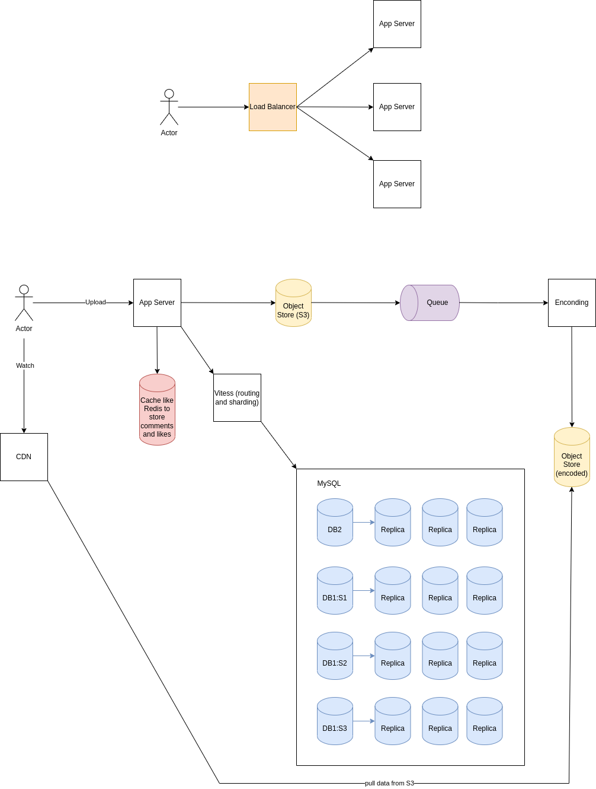

## Youtube - System Design

- Provides reliability, availability, consistency, scalability and low latency
- Encode videos asynchronously using queue like Kafka or RabbitMQ
- Streaming in small chunks
- TCP Protocol
- MySQL replicas
- Using Vitess as a middle layer between app server and database with logic for sharding and routing the requests

 

 
 

### References
- [https://vitess.io/](https://vitess.io/)
- [https://www.youtube.com/watch?v=E6H4bgJ3Z6c](https://www.youtube.com/watch?v=E6H4bgJ3Z6c)
